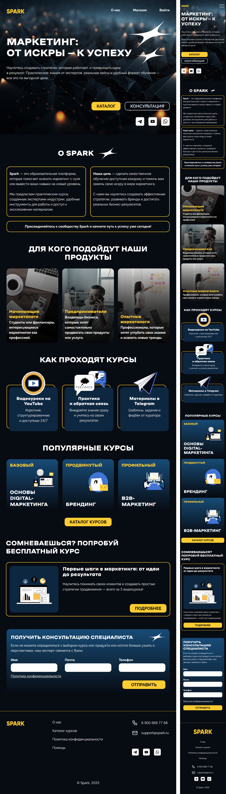

# Spark

Учебный проект по адаптивной верстке лендинга образовательной платформы с курсами по маркетингу.

**Технологии:** HTML5 • CSS3

**Макет Figma:** *[ссылка на макет](https://www.figma.com/design/Nmw77j49bYjlztE6Xqu5Uq/Spark?node-id=32-31&t=BhBdhNTNGmJo95MF-1)*

---

## О проекте

**Spark** — учебный проект, созданный для практики HTML и CSS.

Проект представляет собой лендинг главной страницы платформы онлайн-курсов по маркетингу. Дизайн был разработан самостоятельно в Figma, а техническое задание сформировано с помощью нейросети. Основной целью проекта стало закрепление навыков адаптивной верстки и работы с Flexbox и CSS Grid.

Лендинг включает следующие разделы:

* главный баннер (Hero section);
* описание платформы;
* целевая аудитория;
* информация о формате обучения;
* популярные курсы;
* блок с бесплатным пробным курсом;
* форма получения консультации.

---

## Макет

Дизайн проекта был полностью разработан самостоятельно в **Figma**.

🔗 **Ссылка на макет:** *https://www.figma.com/design/Nmw77j49bYjlztE6Xqu5Uq/Spark?node-id=32-31&t=BhBdhNTNGmJo95MF-1*

---

## Используемые технологии

* HTML5
* CSS3
* Flexbox
* CSS Grid

---

## Особенности проекта

* семантическая HTML-разметка;
* адаптивная верстка;
* breakpoints: **1190px** и **794px**;
* использование Flexbox и CSS Grid;
* hover-эффекты;
* форма обратной связи;
* собственный дизайн, разработанный в Figma.

---

## Что было изучено

Во время разработки проекта были закреплены следующие навыки:

* семантическая верстка;
* построение интерфейсов с помощью Flexbox;
* использование CSS Grid;
* позиционирование элементов;
* адаптивная верстка;
* работа со шрифтами;
* работа с изображениями;
* создание дизайна интерфейса в Figma.

---

## Структура проекта

```text
spark/
├── fonts/
├── img/
├── banner.css
├── clients.css
├── consultation-form.css
├── course-conditions.css
├── fonts.css
├── footer.css
├── free-course.css
├── header.css
├── index.html
├── root.css
├── README.md
```

---

## Запуск проекта

Для запуска проекта достаточно открыть файл `index.html` в браузере.

---

## Скриншоты

### Главный экран


### Полная страница


### Адаптивная версия



### Макет Figma


---

## Цель проекта

Проект создан исключительно в учебных целях для практики адаптивной верстки и закрепления навыков работы с HTML и CSS.

Во время разработки был пройден полный цикл создания интерфейса:

1. проектирование структуры страницы;
2. разработка дизайна в Figma;
3. подготовка технического задания;
4. верстка интерфейса;
5. адаптация под мобильные устройства.

Проект считается завершенным и дальнейшая разработка не планируется.
